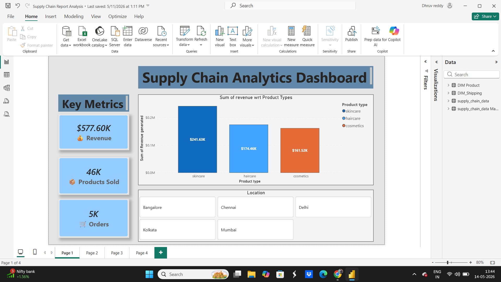
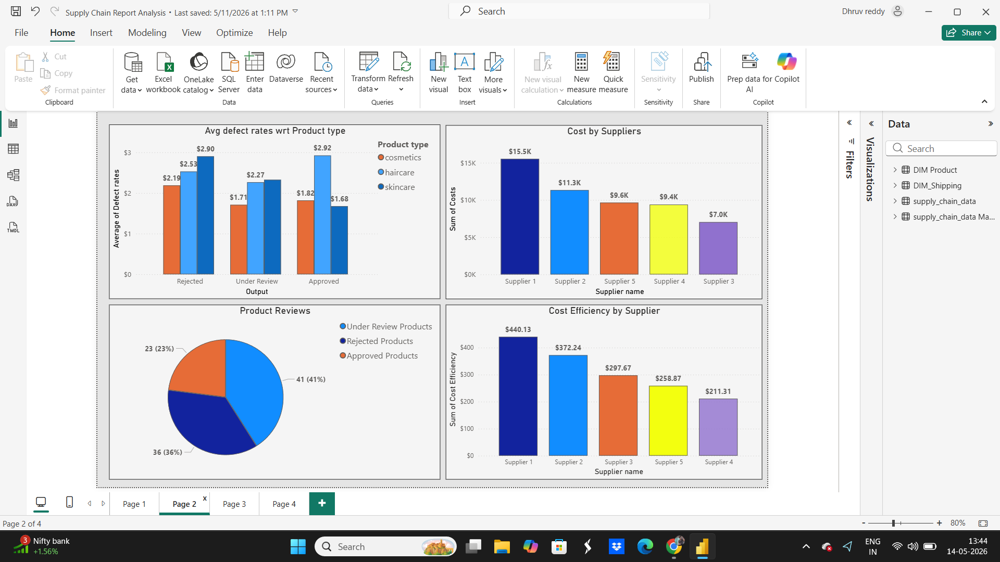
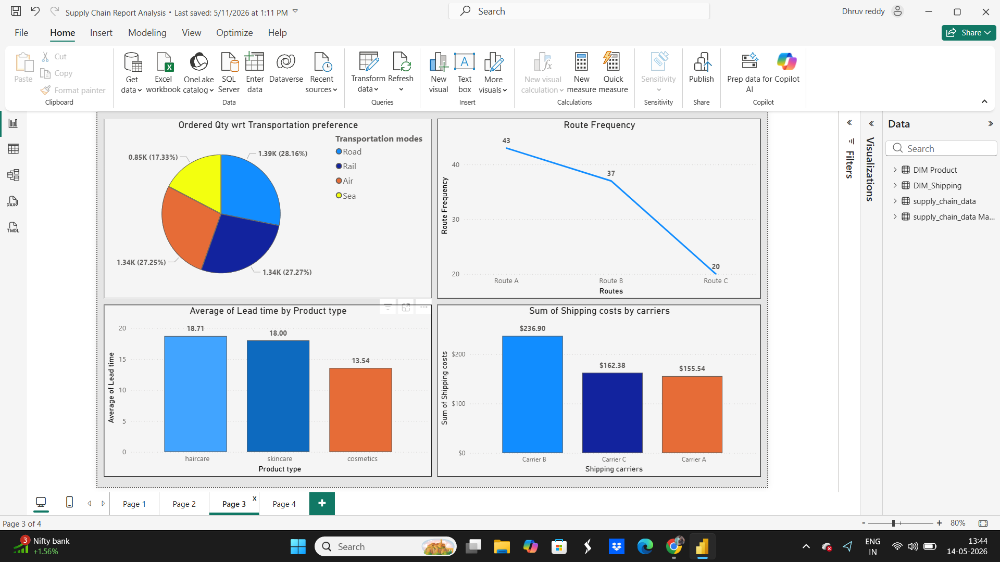
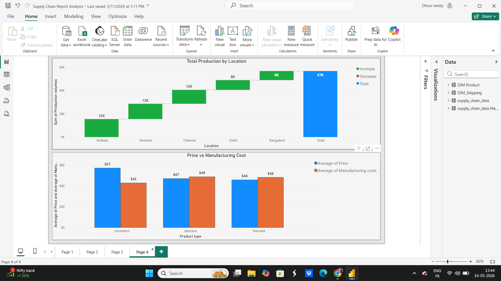

# powerbi-supply-chain-analytics

# Supply Chain Analytics Dashboard using Power BI

## Project Overview

This project presents a comprehensive Supply Chain Analytics Dashboard developed using Power BI. The dashboard provides insights into supply chain operations, supplier performance, logistics efficiency, transportation analysis, production monitoring, and revenue trends.

The report helps businesses monitor operational KPIs and identify areas for optimization in inventory management, shipping, and production.

---

## Tools & Technologies Used

- Power BI
- DAX
- Power Query
- Microsoft Excel

---

## Dashboard Features

### KPI Monitoring
- Revenue Tracking
- Products Sold
- Order Analysis

### Product Analytics
- Revenue by Product Type
- Manufacturing Cost vs Product Price
- Defect Rate Analysis

### Supplier Analysis
- Supplier Cost Comparison
- Cost Efficiency by Supplier

### Logistics & Transportation
- Transportation Mode Analysis
- Shipping Cost Analysis
- Route Frequency Monitoring
- Lead Time Analysis

### Production Insights
- Total Production by Location
- Location-wise Production Monitoring

---
## Dashboard Screenshots

### Dashboard Overview

### Supplier & Product Analysis

### Logistics & Transportation Analysis

### Production & Manufacturing Analysis

---

## Key Insights

- Skincare products generated the highest revenue.
- Supplier 1 showed the highest operational costs.
- Route A had the highest transportation frequency.
- Carrier B contributed the highest shipping costs.
- Cosmetics products showed lower average lead time.

---

## Files Included

| File | Description |
|---|---|
| .pbix | Power BI Dashboard File |
| Dataset | Raw dataset used for analysis |
| Screenshots | Dashboard preview images |

---

## Project Objective

The objective of this project is to analyze supply chain operations and p
er efficiency, and logistics performance.

---

## Author
Dharmik Shah
